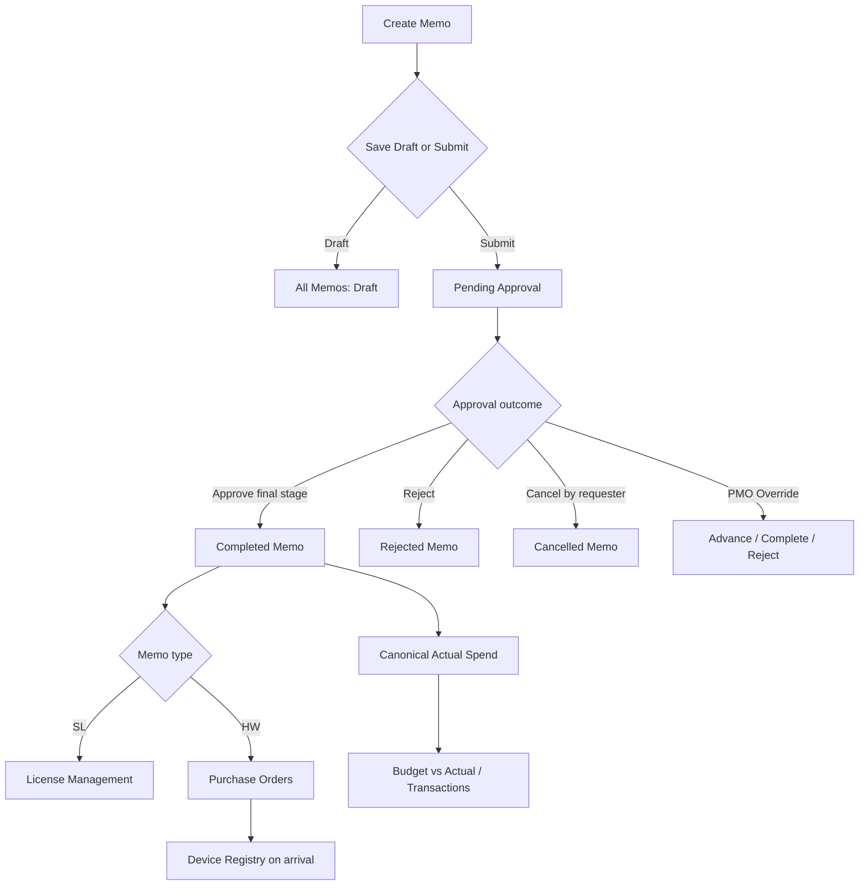
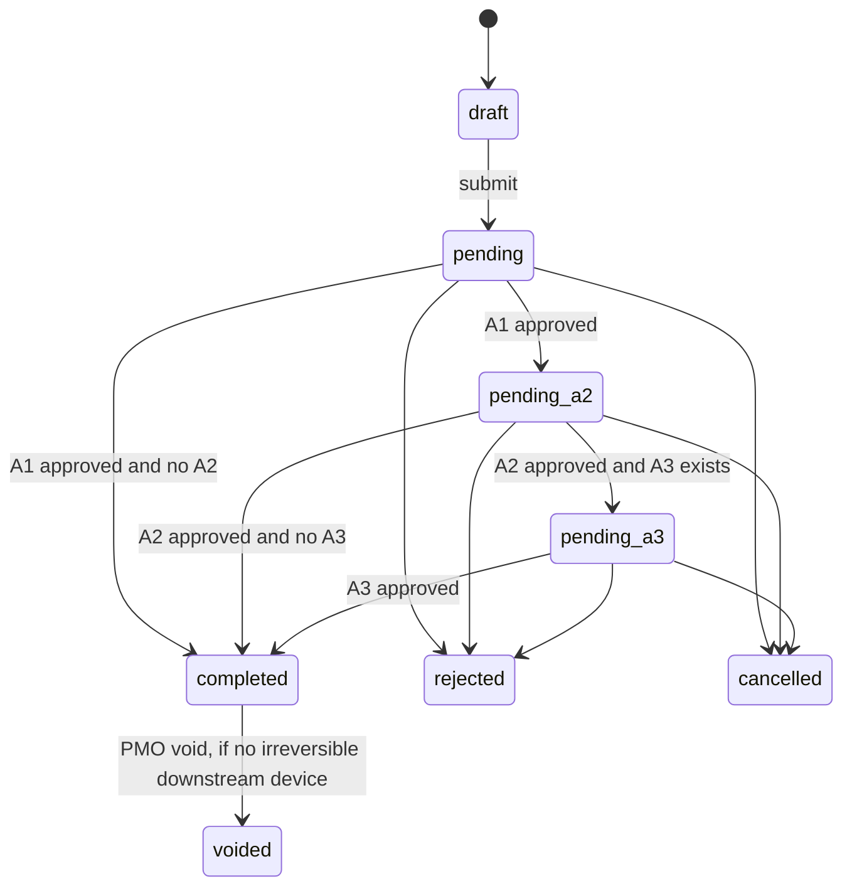
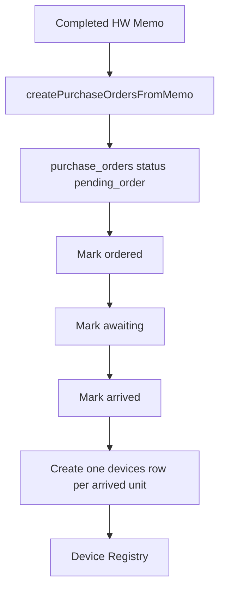

# Business Logic Specification

Technical handoff scope: Memo Management, Approval Workflow, Authority Title & Approval Matrix, Closing Paragraph, Signature Management, Budget & Expense, Actual Spend, Transactions, Device Registry, and License Management.

Related handoff documents: [architecture decisions](./02_ARCHITECTURE_DECISIONS.md), [database reference](./03_DATABASE_REFERENCE.md), [module guide](./04_MODULE_HANDOFF_GUIDE.md), [limitations and tech debt](./05_KNOWN_LIMITATIONS_AND_TECH_DEBT.md), [RC notes](./06_RELEASE_NOTES_RC.md).

## System Context

The PMO ERP implementation is a static browser application (`index.html`, `app.js`, `views/*.js`) backed by Supabase PostgREST when available and localStorage fallback when unavailable. Schema source of truth is `supabase/migrations/`. The runtime configuration is injected through `config.js`.

The business center is the memo. Completed memos create downstream impact; draft, pending, rejected, cancelled, and voided memos do not contribute to canonical Actual Spend. Manual Spending and historical memo imports support legacy spend that did not originate from the current memo approval flow.

## Memo Management

Main files:

- `views/create.js`: memo data collection, validation, draft save, submit.
- `views/pending.js`: pending work queue, approval actions, cancellation, PMO override.
- `views/history.js`: All Memos, read-only detail, duplicate, draft edit/delete, void, budget tagging.
- `app.js`: shared memo storage, Supabase mapping, identity, permissions, audit, PDF, Actual Spend sync.

Supported memo types:

- `sl`: Software License.
- `hw`: Hardware.
- `int`: Team Activity.
- `ent`: Client Expense.
- `dep`: Deployment.

### Memo Lifecycle

Rules implemented:

- `saveDraft()` stores draft memos and applies memo-number collision checks.
- `submitMemo()` validates fields, checks memo number conflicts, then calls `prepareMemoForSubmission()`.
- `prepareMemoForSubmission()` sets `requesterProfileId`, `submittedAt`, `currentApproverProfileId`, and handles A1 self-review bypass.
- `saveMemoAsync()` and `saveMemo()` enforce duplicate memo number collision by using `findMemoNumberCollision()`.
- `memoToDb()` / `dbToMemo()` map browser camelCase fields to `memos` snake_case fields.
- `loadMemos()` hides soft-deleted drafts through `_excludeDeletedMemos()`.
- `draftFromMemo()` clears status, approval, void, and deletion metadata when duplicating or re-editing rejected memos.

Validation rules in `validateMemo()`:

- Common fields: type, memo number, date, project, subject, reason, signature date, supported currency.
- Approval chain: at least A1 reviewer and A2 final approver.
- A1 and A2 must not be the same person.
- Requester cannot be A2/A3.
- Approver rows after A1 must be distinct.
- SL rows require software name, plan, monthly price, months, quantity, start month, end month, and amount words.
- HW rows require at least one item, positive price and quantity, and amount words.
- INT requires activity, date, headcount, cost per person, amount words, at least one participant, and exact headcount/name count match.
- ENT requires customer, event date, place, people count, amount, amount words.
- DEP requires location, start/end dates, headcount, amount words.

Memo-number behavior:

- `MEMO_NO_BLOCKING_STATUSES` blocks reuse for `draft`, `pending`, `pending_a2`, `pending_a3`, `completed`, and `voided`.
- `rejected` and `cancelled` are reusable by current implementation.
- Soft-deleted drafts do not block reuse.
- Database also has `memos.memo_no` unique constraints/indexes in the migrations. The UI still performs pre-checks for clearer errors and compatibility.

## Approval Workflow

The approval route is stored in `memo.approvers` and persisted as `memos.approvers` JSONB. Each row can carry `name`, `title`, `profileId`, `authorityTitleId`, `stage`, `status`, approval metadata, and for approve-stage rows an `authoritySnapshot`.

Actors:

- Requester: creates/submits memo and may cancel their own pending memo.
- Reviewer: A1.
- Approver: A2/A3 approve-stage rows.
- PMO: privilege flag from `user_profiles.is_pmo`, not an approval stage.

Permission helpers in `app.js`:

- `currentUserProfile()`, `currentUserProfileId()`, `currentUser()`, `isPMO()`.
- `isMemoRequester()`, `isMemoApproverInRoute()`, `isMemoCurrentApprover()`.
- `canCurrentUserViewMemo()`, `canCurrentUserViewPendingMemo()`, `canCurrentUserActOnMemo()`.
- `isMemoVisibleInPending()` limits Pending Approval to pending-family memos for PMO/requester/current approver.

Approval actions:

- `openApproveModal()` blocks non-current approvers.
- `confirmApprove()` builds audit entries and calls `updateMemoStatusAsync()` with action keys `approved_a1`, `approved_a2`, or `approved_a3`.
- `updateMemoStatusAsync()` resolves action keys into real statuses, updates approver rows, persists memo status, syncs Actual Spend, and creates hardware POs on completion.
- `confirmReject()` moves valid current-stage targets to `rejected`.
- `cancelMemo()` allows only the requester to cancel pending-family memos.
- `openPmoOverrideModal()` and `confirmPmoOverride()` allow PMO to resolve the current stage with reason and evidence.

PMO override rules:

- Requires PMO role.
- Requires reason and evidence.
- Resolves only the current stage.
- Positive override advances to the next stage if one exists, otherwise completes the memo.
- PMO requester self-override is allowed.
- PMO non-requester cancellation is handled as override, not requester cancel.

## Authority Titles And Approval Matrix

Authority titles are configured in `authority_titles`; approval limits are configured in `authority_limits`. The UI surfaces both in Settings through `views/settings.js`.

Key functions:

- `loadAuthorityTitlesAsync()` loads `authority_titles`, falling back to `AUTHORITY_LIMIT_FALLBACKS`.
- `resolveAuthorityLimit()` resolves by `authority_title_id` first, then legacy title text.
- `authorityTitleMasterRows()`, `authorityLimitStateValue()`, `saveAuthorityTitlesFromDom()`, `saveAuthorityLimitsFromDom()` manage Settings data.
- `buildAuthoritySnapshot()` captures a point-in-time limit/title/policy.
- `applyAuthoritySnapshotsOnApproval()` adds snapshots only when approve-stage rows become approved.
- `resolveMemoAuthorityForPdf()` uses existing snapshot first; legacy memos without snapshots resolve from current config.

Important behavior:

- Review-stage approvals do not create authority snapshots.
- Already-approved approve rows do not get new snapshots.
- Final PDF authority uses the last approve-stage row, not merely the last row in the array.
- Configured zero limits and unlimited limits are distinct.
- Legacy `authority_limits.title` remains supported while `authority_title_id` is the newer preferred key.

## Closing Paragraph

Closing paragraph templates are configured in `memo_closing_templates` and rendered by PDF helpers in `app.js`.

Key functions:

- `memoClosingTemplateForType()`.
- `renderConfiguredClosingParagraph()`.
- `memoSoftwareMetrics()`.
- `authorityLimitText()`.
- Settings helpers: `memoClosingTemplateRows()`, `validateMemoClosingTemplate()`, `saveMemoClosingTemplatesFromDom()`.

Supported placeholders:

- `amount`
- `amount_text`
- `project_name`
- `seat_count`
- `duration_months`
- `authority_title_th`
- `authority_title_en`
- `authority_limit`
- `policy_ref`

Rules:

- Active configured template is used when present.
- Unknown placeholders render blank in PDF output.
- Settings validation rejects unknown/malformed placeholders.
- Authority templates require at least `authority_title_th` or `authority_limit`.
- Authority templates should include `policy_ref`.
- If no configured template exists, the PDF falls back to the hardcoded legacy closing paragraph.

## Signature Management

Signatures are profile-based, with legacy fallback.

Key functions in `views/settings.js`:

- `signatureEligibleProfiles()` lists active reviewer/approver profiles.
- `signatureProfileStorageKey(profileId)` stores local profile-keyed cache as `sig-profile-{id}`.
- `readSignatureDataUrl(owner)` resolves by profile id first, then legacy name/alias keys, then legacy `settings` rows.
- `saveSignatureFromDom()` patches `user_profiles.signature_data_url`.
- `clearSignatureForOwner()` clears profile-keyed local cache and patches `signature_data_url` to null.

Rules:

- Signature files must be images and 500 KB or smaller.
- Stored signatures are keyed to `user_profiles.id`, so profile rename does not break PDF rendering.
- Legacy name/alias localStorage keys remain supported for older data.
- Missing signatures do not block PDF generation.

## Budget And Expense

Budget Pools are the canonical budget targets. Manual Spending, historical memos, infra costs, and completed memos are converted to canonical Actual Spend records for reporting.

Budget Pool key functions:

- `createBudgetPoolRecord()`: canonicalizes pool shape, normalizes Gregorian month values, derives BE `year` from start month.
- `validateBudgetPoolRecord()` and `validateBudgetPoolChange()`: enforce required id/project/budget/range/type rules and duplicate identity.
- `savePoolAsync()`: single pool write path for manual save and import.
- `deleteBudgetPool()`: soft-inactivates pools only when no blockers reference them.
- `budgetPoolDeletionBlockers()`: blocks deletion when canonical Actual Spend, manual expense, memo, or historical memo references the pool.

Budget Pool rules:

- Budget amount must be positive in UI validation.
- Start/end month must form a valid range and cannot span multiple Gregorian years.
- Year is derived from start month; user-supplied year is not trusted when dates exist.
- Duplicate Project + Pool Name + Year is blocked.
- Overlapping Project + Spend Type + Period is allowed; ambiguity is resolved later as `Needs PMO Review`.
- Deletion is a soft status change to `inactive`.

Manual Spending:

- Stored in `budget_manual_expenses` when Supabase is available, localStorage fallback key `orbit-pmo-manual-expenses-v1`.
- `saveManualExpenseAsync()` creates/edits and appends audit entries.
- `voidManualExpenseAsync()` soft-voids by setting `voidedAt`, `voidedBy`, `voidReason`.
- Manual entries can be one-time or monthly.
- Active manual expenses are converted by `manualExpenseToActualSpend()`.

Historical spending:

- Stored as memo-shaped rows in `historical_memos`.
- Added through `openHistoricalSpendingModal()` / `saveHistoricalSpendingFromModal()` in `views/budget.js`.
- Supports SL/HW/INT/ENT/DEP historical records.
- Historical HW lines may link to existing Device Registry rows through `historical_spending_device_links`.

## Actual Spend Lifecycle

Canonical Actual Spend is an application model stored in localStorage key `orbit-pmo-actual-spend-v1`; there is no committed Supabase `actual_spend` table in the current implementation.

Canonical sources:

- Completed current memos: `source = "memo"`, `storageKind = "memo"`.
- Historical memos: `source = "manual_spending"`, `storageKind = "historical_memos"`.
- Manual expense rows: `source = "manual_spending"`, `storageKind = "manual_expense"`.
- Infra cost rows: `source = "manual_spending"`, `storageKind = "infra_cost"`.

Key functions:

- `createActualSpendRecord()`.
- `validateActualSpendRecord()`.
- `actualSpendFromMemo()`.
- `syncMemoToActualSpend()`.
- `manualExpenseToActualSpend()`.
- `infraCostToActualSpend()`.
- `reconcileActualSpendSources()`.
- `mapBudgetPool()`.
- `mapActualSpendRecords()`.

Rules:

- Only `memoStatusKey(memo) === "completed"` current memos become Actual Spend.
- Rejected, cancelled, pending, draft, deleted, and voided memos are excluded.
- Voiding or moving a memo out of `completed` removes its memo-derived Actual Spend record.
- SL memo detail lines are explanatory; parent Actual Spend amount is authoritative.
- Coverage comes from SL line start/end months, DEP start/end dates, or is missing.
- Manual Spending amount for monthly frequency is stored per month and projected to total coverage amount.

Budget mapping:

- Manual override wins if valid.
- Manual override to a different project or year is blocked and becomes `Unbudgeted` with `mappingWarning`.
- Regular manual expense records do not auto-map unless manually overridden.
- One matching pool becomes `Mapped`.
- Zero matches becomes `Unbudgeted`.
- Multiple matches becomes `Needs PMO Review`.

## Transactions Lifecycle

Transactions are the detailed, normalized view of canonical Actual Spend.

Key functions in `views/budget.js`:

- `actualSpendTransactionFromRecord()`.
- `filteredActualSpendTransactions()`.
- `renderManualEntries()` for the Transactions tab.
- `showActualSpendTransactionDetail()`.
- `showCanonicalTransactionDetail()`.
- `canEditActualSpendTransaction()`.
- `exportActualSpendTransactionsCSV()`.

Rules:

- Transactions include completed memo records and active manual/historical/infra records.
- Pending/rejected memos and voided manual expenses are excluded.
- Source labels collapse to user-facing `Memo` and `Manual Spending`.
- Memo transaction rows are view-only.
- Editable manual expense records show Edit/Delete only for PMO and only when `storageKind === "manual_expense"`.
- Historical/imported memo-shaped records are view-only from Transactions.
- Transaction export reuses the same filtered dataset as the table.

## Device Registry Integration

Hardware memos do not immediately create devices. They create Purchase Orders when the memo becomes completed. Devices are created only when PO arrivals are marked.

Key files/functions:

- `views/device.js`
- `createPurchaseOrdersFromMemo()`
- `_hwLineItemsFromMemo()`
- `advancePOStatus()`
- `markArrived()`
- `saveDeviceAsync()`
- `deleteDeviceAsync()`
- `cancelPurchaseOrdersForVoidedMemo()`

Device flow:

Rules:

- PO id is derived from memo number, line index, and item name to avoid collisions for duplicate item names.
- PO quantities enforce `orderedQty > 0`, `arrivedQty >= 0`, and `arrivedQty <= orderedQty`.
- Mark arrived is allowed only from `awaiting` or `partial_arrived`.
- Mark arrived cannot exceed remaining quantity.
- Mark arrived is blocked if the source memo is voided/rejected/cancelled.
- Device rows created from PO arrival use `source = "memo"`, carry `memoNo` and `purchaseOrderId`, and start as `available`.
- Device delete is a soft delete with audit log and also unlinks spending/device joins.
- Voiding a completed HW memo is blocked if any Device Registry row already references that memo.
- If a completed HW memo is voided before devices arrive, POs are marked `voided_source`, not deleted.

Historical HW Device links:

- Manual/historical HW spending can link to existing unlinked devices.
- Link eligibility is enforced by `deviceEligibleForSpendingLink()`.
- Ineligible devices: deleted, retired, memo/PO-sourced, or already linked elsewhere.
- Links do not create devices or POs.
- Editing a linked historical HW line cannot remove the line or reduce quantity below linked count.

## License Management Integration

License Management derives license inventory from completed SL memo line items plus manual license rows.

Key functions in `views/license.js`:

- `parseLicenseFromMemo()`.
- `_parseSlItemsFromHtml()` legacy fallback.
- `parseAccountTableFromMemo()`.
- `getAllLicenses()`.
- `getLicenseStatus()`.
- `computeLicReconciliation()`.
- `_licSeatsByProjectSoftwarePlan()`.
- `saveLicenseAsync()`.
- `deleteLicenseAsync()`.

Rules:

- Only completed SL memos produce memo-derived licenses.
- `slItems` JSON is preferred over parsing rendered HTML.
- Legacy memo HTML parsing remains for older memos with missing `slItems`.
- Each SL line becomes one license record, id keyed by memo/source, line index, software, plan, and coverage.
- Historical SL memos are included with a `historical-{id}` source prefix.
- Manual licenses are stored in `licenses` table with `source = "manual"`.
- Manual rows may override owner/department/status/note for matching memo-derived ids.
- Deleting a manual license is soft via `statusOverride = "deleted"`.
- Expiry status is calculated dynamically: expired, expiring within 7/15/30 days, active, cancelled/deleted.
- User license mapping uses account table data from SL memo sections plus review/override/manual rows.
- License reconciliation compares purchased seats from effective license inventory against assigned users.

## Edge Cases And Legacy Compatibility

- Supabase unavailable: most modules fall back to localStorage and later sync where supported.
- Schema-cache lag: manual expense, device, and PO writes retry without newly added `audit_log` / `vendor_program` fields when PostgREST reports missing columns.
- Authority titles resolve by id first, then legacy title text.
- Signatures resolve by profile id first, then legacy name and aliases.
- Legacy HW PO creation can scrape rendered HTML if `hwItems` is missing.
- Legacy SL license derivation can parse rendered HTML if `slItems` is missing.
- Historical memos are memo-shaped but are distinct from `memos`.
- Actual Spend source values are intentionally only `memo` and `manual_spending`, while `storageKind` preserves the lower-level origin.

