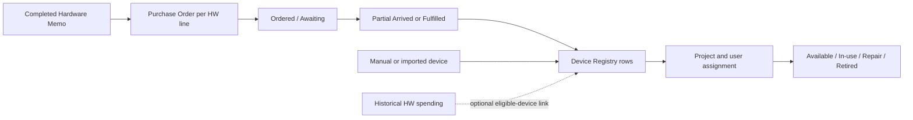
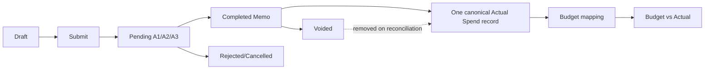
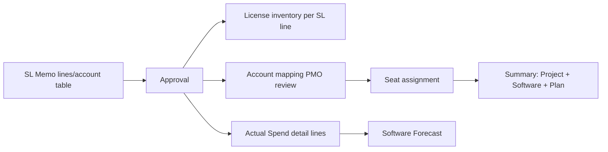
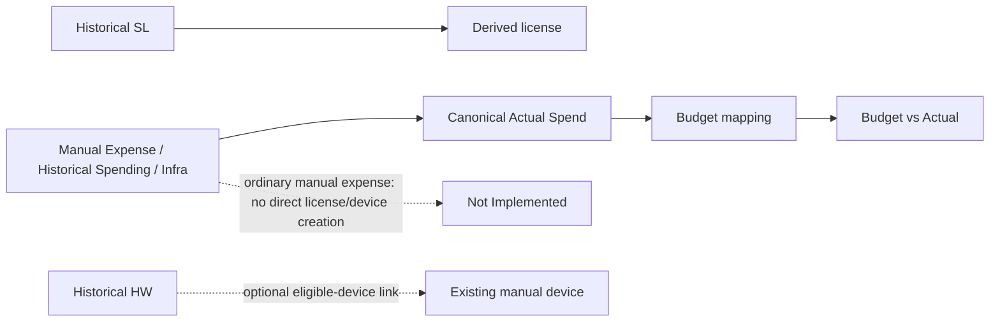
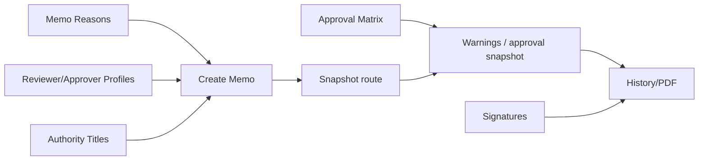

# PMO_ERP Functional Requirements — As-Is Implementation

## 1. Document Purpose

This document describes the business behavior implemented in the current PMO_ERP browser application as of 15 July 2026. It is a reverse-engineered **As-Is** specification, not a statement of desired behavior. Each material rule is classified as **Confirmed**, **Inferred**, **Unclear**, **Inconsistent**, or **Not Implemented**.

Primary evidence is the last active browser-loaded definition in `app.js` and `views/*.js`, followed by tests and migrations. Earlier duplicate declarations in `app.js` are not treated as live when a later declaration has the same name.

## 2. Scope and Exclusions

In scope: Memo Management, Approval Workflow, Budget & Spend (Overview, Actual Spend, Forecast, Budget vs Actual, Budget Pool), License Management, Device Management, and only Memo Reasons, Approver/Reviewer, Authority Titles, Approval Limit Matrix, and Signatures within Settings.

Explicitly excluded: Resource Management, Transaction/Audit Log, unrelated Settings panels, teammate-owned features, roadmap items, and refactoring. References to excluded areas are dependency-only.

## 3. User Roles and Definitions

| Role/concept | As-Is meaning | Confidence |
|---|---|---|
| Requester | Auth/session user stored on the memo as requester name/profile ID. May also be A1 Reviewer and is then auto-bypassed; may not be A2/A3. | Confirmed |
| A1 Reviewer | First approval-route row; selected from active profiles with `can_review`. | Confirmed |
| A2 Final Approver | Mandatory second route row; selected from active profiles with `can_approve`. | Confirmed |
| A3 Approver | Optional third route row; maximum route length is three. | Confirmed |
| PMO | Session role `pmo`; can see all memos, override a current pending step, and edit unresolved route rows. | Confirmed |
| Identity match | Profile ID is preferred; name/email compatibility is used for legacy records. | Confirmed |
| Authentication limitation | The README describes an auth-ready mock/session facade and anonymous PoC database policies; UI visibility is not a production security boundary. | Confirmed |

## 4. Shared Concepts and Master Data

- Spend types are `Software`, `Hardware`, `Team Activity`, `Client Expense`, `Deployment`, `Infra`, and `Others`. Memo type codes map as `sl`, `hw`, `int`, `ent`, and `dep`. **Confirmed** (`app.js:78-104`).
- User-facing Actual Spend sources are only **Memo** and **Manual Spending**. Historical spending, recurring manual expenses, and Infra Cost all use source `manual_spending`; `storageKind` distinguishes `historical_memos`, `manual_expense`, and `infra_cost`. **Confirmed** (`app.js:106-125`; `tests/source_classification.test.js`).
- Only THB is accepted by the canonical financial validation. No currency conversion is performed. **Confirmed** (`app.js:126-127, 243-259`; `views/create.js:503-665`).
- Supabase is preferred when configured; memory/local storage remains an offline/fallback cache. A failed local-storage write warns and memory remains usable. **Confirmed** (`app.js:2966-3307, 3499-3589`; `tests/pdf_storage_cleanup.test.js`).
- Active project choices come from `organization_projects` with status `active`, with settings/local fallback. **Confirmed** (`app.js:1000-1031`; migrations).

## 5. Memo Management

### Purpose, entry points, and display

Create Memo is opened from Memo Management. Memo History contains Draft, Pending, Completed, Rejected, Cancelled, and Voided tabs/filters; Pending Approval is a role-filtered work queue. Detail views display header, type-specific information, route/timeline, linked license/device/PO actions where applicable, budget tagging, and PDF actions. **Confirmed** (`index.html:1131-1160`; `views/history.js`; `views/pending.js`).

### Memo types and calculations

| Type | Stored/detail behavior | Total formula | Key validations | Downstream use |
|---|---|---|---|---|
| Software License (`sl`/SL) | One or more structured `slItems`; optional account matrix by email/software. | Sum of `price × months × qty` per line. | Name, plan, positive monthly price/months/qty, start and end required; amount words required. The form does **not** explicitly reject end before start. | Approved memo → one Actual Spend record with detail lines; inventory license per software line; account rows feed license-user review/mapping; Software forecast. |
| Hardware (`hw`/HW) | One or more structured `hwItems`; optional custodian text. | Sum of `price × qty`. | At least one named line; positive price/qty; amount words. | Approved memo → one Actual Spend record and one PO per hardware line; arrival creates devices. |
| Team Activity (`int`/INT) | One-time scalar activity/date/headcount/per-person value plus participant names. | `per-person amount × number of name rows`. | Positive headcount/per-person; date/activity/names/amount words; filled-name count must equal headcount. | One Actual Spend record; excluded from Forecast. |
| Client Expense (`ent`/ENT) | One-time customer, event date, venue, people, total. | Entered total. | Customer/date/venue, positive people/amount, amount words. | One Actual Spend record; excluded from Forecast. |
| Deployment (`dep`/DEP) | Scalar start/end/location/headcount plus optional calculated/text expense rows. | Sum of filled calculated rows `price × qty`; may remain zero if only text rows are entered. | Location, start/end, positive employee count, amount words. No explicit start ≤ end check. | One Actual Spend record; excluded from Forecast. |

**Conclusion:** Hardware and Software require commercial detail lines. INT/ENT are one-time scalar business records, while DEP is primarily one-time but also stores its own expense-item structure. **Confirmed** (`views/create.js:503-787`; `tests/spend_type_detail_rendering.test.js`).

### Common create, draft, submit, and numbering rules

- Required common fields are type, manually entered Memo No., memo date, project (or Other text), supported currency, nonblank subject, reason, signature date, A1 and A2 names/titles. Subject may be typed or generated. “To” is derived from the final route row’s title. **Confirmed**.
- Route must contain 2–3 rows. A1 and A2 must differ; requester cannot be A2/A3; duplicate route identities are rejected. Requester may be A1. **Confirmed** (`views/create.js:666-787, 1380-1515`).
- Save Draft validates common/type fields through the same collection path, stores status `draft`, and updates the same draft by ID/number. Draft edit restores structured rows, account selections, type-specific fields, route title overrides, project/currency, and date. Duplicate/re-edit-rejected creates a new draft identity. **Confirmed** (`views/create.js:832-910, 1700-1984`; `views/history.js:1138-1249`).
- Memo number uniqueness is checked locally and remotely. Draft, pending-family, completed, and voided records block reuse; rejected and cancelled may be reused in the pre-check, although the database unique constraint may still conflict if the row remains. **Inconsistent** (`views/create.js:789-830`; `tests/memo_number_collision.test.js`; migration unique index).
- Submit transforms the draft/form into a route snapshot, records submission metadata, and advances to Pending A1, Pending A2 (self-A1), or directly Completed if no pending row remains. **Confirmed** (`app.js:1899-1946`; `views/create.js:873-911`).

### History actions, PDF, filtering, and states

- History filters by status, search, requester, approver, project, type, amount, preset/custom dates; results are sorted by activity date and paginated 20 at a time. CSV export uses the filtered set. **Confirmed** (`views/history.js:11-224, 1003-1137`).
- Drafts can be edited, soft-deleted, or duplicated. Rejected memos can be re-edited as a new draft. Pending requester/PMO cancellation and completed PMO void are separate terminal actions. **Confirmed** (`views/history.js:1029-1250`; `views/pending.js:978-1008`; `app.js:3254-3304`).
- Void requires a reason, is blocked when irreversible downstream records exist, removes the memo from canonical spend, and marks unfulfilled source POs `voided_source`; arrived devices are retained. **Confirmed**.
- PDF rendering uses the current memo plus approval snapshots/signatures. Generation stages temporary DOM and cleans it on success/fallback. Repeated generation does not intentionally persist another business record. Server failure falls back to print. **Confirmed** (`app.js:3844-4721`; PDF tests).
- Empty lists show an empty state; remote refresh errors fall back to cached data in several paths. Loading indicators are page-specific rather than a single application-level standard. **Confirmed/Inconsistent**.

## 6. Approval Workflow

### User-facing behavior

1. Submission freezes the selected route inside `memos.approvers`. A profile/master change does not rewrite that route automatically. **Confirmed**.
2. If requester is A1, A1 is stored as `bypassed` with approval time/user and the memo starts at A2. Requester cannot self-approve A2/A3. **Confirmed** (`app.js:1899-1946`).
3. Pending status corresponds to current stage: `pending` = A1, `pending_a2` = A2, `pending_a3` = A3. Only the current route identity can approve/reject; PMO can view/override. **Confirmed** (`app.js:1798-1848`).
4. Approval marks only the current row approved and advances sequentially. The final approval sets `completed`, `approvedAt`, and downstream financial/device side effects. Rejection sets the current row and memo `rejected`; there is no return-to-requester state. **Confirmed**.
5. PMO Override applies only to pending-family statuses, requires a note and evidence (≤5 MB), resolves only the current step as `overridden`, and either advances, completes, or rejects. Resolved rows remain locked. **Confirmed** (`views/pending.js:568-810`).
6. Pending list shows records visible to the current actor; History shows requester, route participant, or PMO records. Search/filter/export and load-more are implemented. **Confirmed**.
7. Authority limits are displayed as route guidance and captured as snapshots when an approve-stage row becomes approved. The active approval transition does not block approval solely because amount exceeds the configured limit. **Confirmed/Inconsistent** (`views/create.js:1516-1600`; `app.js:1460-1690`; authority tests).

### Technical dependencies and limitations

- Profile selection requires active `user_profiles`; reviewer options require `can_review`, approver options require `can_approve`. Missing or inactive legacy selections may be preserved for history/draft compatibility but are not normally offered. **Confirmed**.
- Identity resolution prefers profile IDs and falls back to names/aliases. Missing authentication email/profile mapping can hide an otherwise expected pending memo or prevent action. **Confirmed**.
- UI permissions are not backed by production-grade RLS: current migrations retain broad PoC access. **Confirmed**.
- Cancellation authorization is primarily exposed through UI visibility; several persistence functions rely on their callers. **Unclear**.

## 7. Budget & Spend

### 7.1 Overview

Purpose: show period-based financial KPIs, monthly trend, spend composition, and Budget-vs-Actual summary. The canonical dataset is Actual Spend plus Budget Pools. Filters support period presets/custom month range, project, spend type, and grouping. **Confirmed** (`views/budget.js:930-1451`).

KPI calculations use the filtered canonical records: budget is the applicable pool total; actual is sum of record amounts/period values; remaining/variance is budget minus actual; charts aggregate monthly and by spend type. Empty datasets render zero/empty chart states. Drill-down routes to BvA/Actual Spend views. No dedicated Overview export is evident. **Confirmed/Not Implemented**.

### 7.2 Actual Spend

- Reconciliation sources are completed live memos, nondeleted historical memos, active manual expenses, and Infra Costs. Pending/rejected/voided sources do not contribute. **Confirmed** (`views/budget.js:421-556`; tests).
- Each completed memo or historical memo produces exactly one canonical Actual Spend record. Software line items remain nested `detailLines`; they do not create separate top-level actual records. Edits reconcile by stable ID rather than duplicate. **Confirmed** (`app.js:1306-1392`; historical tests).
- Effective memo amount is memo total. Effective date is approval, update, or creation date; coverage uses memo/type dates and Software line detail when available. Manual recurrence expands by month for reporting; Infra carries configured coverage. **Confirmed**.
- Visible source classification is exactly **Memo** or **Manual Spending**. Infra appears as spend type `Infra` and `storageKind=infra_cost`, not a third source. **Confirmed**.
- Budget outcomes are `Mapped` (one automatic match), `Unbudgeted` (none or ordinary manual expense without explicit assignment), `Needs PMO Review` (multiple matches), and `Manual Override` (valid explicit pool). Cross-project/year overrides are blocked and cleared with a warning. **Confirmed** (`app.js:600-690`).
- Report groups by project/spend type/source and supports date/project/type/source/status/search filtering, totals, detail drill-down, and filtered CSV. Transactions is a flat combined list with view detail; only `manual_expense` rows can be edited/voided there. Historical/memo records are read-only and edited at their source. **Confirmed**.
- Manual Expense requires reference, project, spend type, positive amount, date/range and recurrence fields as applicable; void is soft deletion with audit metadata. Historical Add Spending supports SL/HW/INT/ENT/DEP structured forms, cross-table reference uniqueness, edit, and soft delete. **Confirmed**.
- Imports validate dates, amount, source/spend type, and duplicate key. Historical workbook parsing validates cross-sheet references. Actual Spend template/export is implemented. Some import flows are all-or-nothing; error presentation differs by importer. **Confirmed/Inconsistent**.
- Detail rendering is spend-type aware for Memo and Manual Spending. Hardware historical records can link eligible devices; live approved HW records use Memo→PO/device linkage instead. **Confirmed**.

### 7.3 Forecast

- Eligibility is strictly `Software` and `Infra`; Hardware, Team Activity, Client Expense, Deployment, and Others are excluded even if actual exists in the window. **Confirmed** (`app.js:700-918`; forecast tests).
- Window is 12 months: previous six months labeled Actual, current month plus next five labeled Forecast. Component eligibility also considers a 12-month lookback for recurring records. **Confirmed**.
- Software memo/historical detail lines become separate components. Legacy Software without lines and all Infra/manual records use record-level components. Final row grain is project + program/vendor + plan + spend type; matching components merge into one row but retain distinct contributors. **Confirmed**.
- Monthly amount is `lineAmount ÷ coverageMonths` when a valid total/coverage exists, otherwise available monthly cost/record amount rules apply. Actual months contain supported source contributions. Future supported months use source contributions; after supported recurring coverage, latest actual may be carried forward as forecast-only with zero contributors. **Confirmed**.
- A cell is underlined/clickable only when displayed value equals supported contributor value and contributors exist. Carry-forward-only/expired unsupported cells are not clickable. Breakdown retains parent record and line index. **Confirmed**.
- Cancellation/end/expiry effects come from canonical coverage/status. Cancelled licenses are excluded from license inventory forecast input, but canonical Actual Spend has no general cancellation field. “Expiry” is a license concept; a completed memo’s spend remains unless voided. **Inferred/Unclear**.
- Filters cascade project → program → plan plus software/infra type. CSV mirrors the currently built on-screen rows/month order and is empty-safe. **Confirmed**.

### 7.4 Budget vs Actual

- Primary row grain is Budget Pool; unmatched canonical records appear in unbudgeted/review sections. Budget comes from the pool; actual is the sum of records whose final pool ID is that pool. Variance is `Budget − Actual`; utilization is `Actual ÷ Budget × 100` where budget is nonzero. **Confirmed** (`views/budget.js:3577-4044`).
- Filters include year, project, spend type, status/search; filtered CSV is implemented. Drill-down shows contributing records and routes Memo, historical spending, ordinary manual, and Infra through canonical detail. **Confirmed**.
- Multiple matching pools produce Needs PMO Review until PMO assigns one. Manual assignment uses the canonical mapping engine and persists back to the source record. **Confirmed**.
- Soft-deleted/voided source records are excluded after reconciliation. Missing project/date/type can leave records unbudgeted or invalid. **Confirmed**.

### 7.5 Budget Pool

- Users can create/edit pools with project, name, positive THB budget, one or more spend types, start/end month in one Gregorian year (displayed/derived as Buddhist year), and generated ID. **Confirmed** (`app.js:300-520`; `views/budget.js:3466-4570`).
- Duplicate project + pool name + year is rejected. Overlapping project/type/period pools are allowed after warning/manual confirmation; overlap intentionally causes Needs PMO Review at mapping time. **Confirmed**.
- Mapping priority: valid manual override → one automatic project/type/date match → multiple-match review → unbudgeted. Ordinary recurring manual expenses are deliberately not auto-mapped; historical spending is auto-mapped. **Confirmed**.
- Delete is a guarded soft delete in Supabase (`deleted=true`) and is blocked or warned when referenced, depending on blocker type. UI reads exclude deleted pools. **Confirmed**.
- Bulk template/import supports create/update by Pool ID, validates each row, rejects duplicate/unknown IDs, and previews changes. Export uses visible filters. **Confirmed**.
- UI has no active/inactive status selector although the data table includes status/deleted compatibility fields. **Inconsistent**.

## 8. License Management

- Inventory combines licenses derived from completed SL memos/historical SL spending and nondeleted rows in `licenses`. Memo license purchase date is approval/update/create date. Each Software line becomes a license record; legacy memo HTML may be parsed. **Confirmed** (`views/license.js:15-249`).
- Manual create/edit fields include software, plan, project, program, purchase/start/expiry/cancellation dates, seats, monthly price/currency, and status override. Manual delete is soft delete. **Confirmed**.
- Date validation rejects expiry earlier than purchase date, but does not consistently compare expiry with start date. Bulk import uses the same purchase/expiry check. **Confirmed/Gap** (`views/license.js:53-60, 2335-2418`; `views/bulk_import.js:75-81,282-365`).
- Status: explicit cancelled wins; otherwise expiry drives Expired/Expiring 7/15/30 days/Active. Missing expiry is Active. Cancelled inventory is excluded from summary and assignable identities. **Confirmed**.
- License Summary grain is exactly **Project + Software + Plan**. Purchased Seats = sum of `seats` for noncancelled inventory in that grain. Assigned Users = distinct user/email assignment groups active for that identity. Remaining Seats = Purchased − Assigned and may be negative. **Confirmed** (`views/license.js:667-845`; `tests/license_summary_consolidation.test.js`).
- Filters cover project, software, plan, status/year and Over-assigned/Has Remaining. Summary drill-down lists assigned users; CSV exports the filtered six-column summary. **Confirmed**.
- Account mapping from newly approved SL memos enters a PMO review queue; pre-rollout memos are grandfathered approved. Rejected account mappings do not enter live user mapping. Users may be assigned/unassigned manually; CSV import classifies valid, duplicate, ambiguous, rejected and writes only valid rows. **Confirmed**.
- Assignment import requires email/software/project; plan may be omitted only when inventory resolution is unambiguous. Over-assignment is allowed and surfaced as negative remaining seats rather than blocked. **Confirmed**.
- Memo/source detail links and user drill-down are implemented. There is no hard database constraint preventing over-assignment. **Confirmed**.

## 9. Device Management

- A completed HW memo creates one PO per hardware line, idempotently. PO starts `pending_order`, can move to `ordered`, `awaiting`, `partial_arrived`, or `fulfilled`. Mark Arrived creates one device per arrived unit/serial; cumulative arrived quantity cannot exceed ordered quantity. **Confirmed** (`views/device.js:370-550`).
- If the source memo is rejected/cancelled/voided before fulfillment, outstanding POs become/effectively display `voided_source` and cannot advance. Fulfilled/arrived devices are not retroactively removed. **Confirmed**.
- Manual create/import is supported. Registry fields include identification/serial/asset identifiers, model/category/spec/storage, dates/warranty, project(s), assigned user, status, QA owner, source memo/PO, notes/photo. **Confirmed**.
- Device identity validation compares serial number, Asset IT, and related canonical identifiers case-insensitively and blocks duplicate create/edit/import. Missing identifiers are visibly flagged. **Confirmed** (`views/device.js:559-636`; hardware tests).
- Status is normalized; QA owner can imply default `in-use`, otherwise `available`. Assignment/unassignment occurs through editable device fields; no separate immutable assignment transaction model exists in this view. **Inferred**.
- Search spans current fields and audit/history content (“memory search”); filters include project, status, category/source and pagination. CSV export exists for registry and POs; bulk template/import is implemented. **Confirmed**.
- Historical HW Spending can link only nondeleted, nonretired, otherwise-unlinked devices that do not already have an approved Memo/PO source. Each device can link to one historical hardware line. Spending Detail refreshes after link/unlink; device detail has navigation context back to spending/PO/memo. **Confirmed** (`app.js:2331-2514`; `views/device.js:1900-2037`).
- Device deletion is soft delete through `deleted/deleted_at`; photo upload accepts JPEG/PNG/WebP. Role-specific server enforcement is not evident. **Confirmed/Unclear**.

## 10. Settings — Memo & Approval Only

### 10.1 Memo Reasons

Reasons have stable ID, memo type, Thai/English labels, sort order, and active state. Active reasons for the selected type populate Create Memo. Settings supports add/edit/deactivate and persists through the settings model; fallback/default reasons are used when canonical lists are absent. An intentionally empty list may therefore be repopulated by fallback normalization rather than remain empty. **Confirmed/Concern** (`views/settings.js:696-925,1073-1098,1814-1825`; `views/create.js:39-83`).

### 10.2 Approver / Reviewer

Rows come from `user_profiles`. Settings edits names/email/aliases, `can_review`, `can_approve`, active flag, and default authority title. Active eligible profiles populate Create Memo; requester exclusion is enforced for A2/A3 during validation, not necessarily removed from every dropdown. Legacy/incomplete rows are normalized and may be preserved for old drafts. **Confirmed** (`views/settings.js:2317-2528`; `views/create.js:1041-1125`).

### 10.3 Authority Titles

Canonical fields are Thai title, English title, sort order, active flag. Create Memo defaults from profile `default_authority_title_id`; users may override per route row. Inactive/legacy current values are preserved but not generally offered. Titles and approval snapshots appear in details/PDF. **Confirmed**.

### 10.4 Approval Limit Matrix

Matrix key is Authority Title × memo type (`sl`, `hw`, `int`, `ent`, `dep`) with numeric THB limit, unlimited flag, policy reference, and active metadata. UI distinguishes unconfigured, configured zero, numeric, and unlimited. Save upserts configured cells and removes cleared rows. Limits provide warnings and PDF wording/snapshots; they do not automatically add route levels or block approval. **Confirmed/Inconsistent** (`supabase/migrations/20260713132302_approval_authority_configuration.sql`; settings/authority tests).

### 10.5 Signatures

Eligible active reviewer/approver profiles appear once. PNG/JPEG-compatible data URLs are previewed, replaced, saved to `user_profiles.signature_data_url`, or cleared by profile ID, with legacy local keys/name aliases as fallback. PDF lookup prefers profile ID. Missing signature leaves blank signature space and does not prevent approval/PDF. **Confirmed** (`views/settings.js:1151-1227,2140-2309`; signature tests).

## 11. Cross-Module Data Flow

### Flow A — Memo to Actual Spend

### Flow B — Software Memo to License

### Flow C — Hardware Memo to Device

### Flow D — Manual Entry

### Flow E — Settings to Memo Approval

## 12. Permissions and Visibility Matrix

| Action | Requester | Current A1/A2/A3 | PMO | Other user |
|---|---:|---:|---:|---:|
| View own/route memo history | Yes | Yes | All | No |
| See memo in Pending | If current actor/self case | Yes | All pending | No |
| Approve/reject current stage | No, except self-A1 bypass at submit | Yes | Via Override | No |
| Cancel pending memo | UI permits requester/PMO | Not normally | Yes | No |
| Void completed memo | No | No | Yes, subject to blockers | No |
| Edit unresolved route | No | No | Yes | No |
| Create/edit Budget, License, Device | UI does not consistently enforce a role | UI does not consistently enforce a role | Yes | Potentially yes |

The last row is a security limitation, not an authorization requirement.

## 13. Status Transition Matrix

| Record | From | Action | To |
|---|---|---|---|
| Memo | New | Save Draft | `draft` |
| Memo | Draft/New | Submit | `pending`, `pending_a2`, or `completed` |
| Memo | `pending` | A1 approve | `pending_a2`/`completed` |
| Memo | `pending_a2` | A2 approve | `pending_a3`/`completed` |
| Memo | `pending_a3` | A3 approve | `completed` |
| Memo | Pending family | Reject | `rejected` |
| Memo | Pending family | Cancel | `cancelled` |
| Memo | Pending family | PMO override | next pending / `completed` / `rejected` |
| Memo | `completed` | PMO Void | `voided` |
| PO | `pending_order` | Mark ordered/awaiting | `ordered`/`awaiting` |
| PO | active | Arrival below/at ordered qty | `partial_arrived`/`fulfilled` |
| PO | unfulfilled + terminal source | cascade/effective rule | `voided_source` |
| License | date-driven | expiry thresholds | Active/Expiring/Expired |
| License | any | override cancellation | Cancelled |
| Device | editable | assignment/lifecycle edit | available/in-use/repair/retired and supported custom normalization |

No memo return/rework status is implemented.

## 14. Calculation Rules

| Calculation | Formula |
|---|---|
| SL memo line | Monthly price × months × quantity |
| HW memo line | Unit price × quantity |
| INT total | Per-person amount × count of participant rows |
| Budget variance | Budget Pool amount − mapped Actual Spend |
| Utilization | Actual ÷ Budget × 100 (when Budget > 0) |
| Coverage months | `(endYear − startYear) × 12 + endMonth − startMonth + 1` |
| Forecast monthly allocation | Supported line/record total ÷ inclusive coverage months, with monthly-cost fallback |
| Purchased seats | Sum seats for noncancelled licenses at Project+Software+Plan |
| Assigned users | Distinct active assigned user/email groups at the same grain |
| Remaining seats | Purchased seats − Assigned users; negative is retained |

## 15. Validation and Error Handling

Validation is primarily client-side alerts plus model validators. Required/positive/range/duplicate checks are described above. Supabase errors commonly fall back to local cache and console warning; some actions offer explicit failure alerts. Database constraints cover keys and selected fields but broad anonymous policies remain. File uploads constrain type/size in specific flows. There is no single transaction boundary across memo approval, Actual Spend cache synchronization, PO creation, and all derived modules. **Confirmed/Limit**.

## 16. Import and Export Rules

| Area | Import | Export |
|---|---|---|
| Memo | INT participant and SL account spreadsheet helpers; no general live memo bulk import | Pending/History filtered CSV; PDF |
| Actual Spend | Template/workbook for manual/historical records; row/date/duplicate validation | Filtered report and transaction CSV |
| Forecast | None | Current forecast dataset CSV |
| Budget Pool | Create/update preview by Pool ID | Visible/filtered pool CSV |
| License | Inventory bulk import and assignment CSV preview | Inventory, users, and filtered summary CSV |
| Device | Bulk template/import with identity validation | Registry and PO CSV |

## 17. Empty, Negative, and Edge Cases

- Empty lists render page-specific empty states; exports emit headers/empty rows where tested.
- Zero/negative financial amounts are rejected for canonical spend/pools and main memo numeric inputs.
- License Remaining Seats may be negative and can be filtered as over-assigned.
- Missing license expiry remains Active; missing device identity is allowed but flagged, while duplicate populated identifiers are blocked.
- Multiple pool matches never select arbitrarily; they require PMO review.
- Forecast carry-forward may display a nonclickable value without a current supporting contributor.
- Legacy memo HTML, title text, name-based signatures, and missing profile IDs have compatibility paths; confidence is lower than canonical-ID records.

## 18. Known Limitations

1. UI permission checks are not equivalent to server security/RLS.
2. Authority limits warn and document but do not enforce approval amount or route construction.
3. Duplicate active/dead declarations in `app.js` create maintenance risk; only final declarations are live.
4. Memo number reuse policy conflicts with persistent database uniqueness for rejected/cancelled rows.
5. Several date-order validations are missing or partial (SL/DEP, license start vs expiry).
6. Cross-module completion side effects are not one atomic transaction.
7. Ordinary manual recurring expense is deliberately unbudgeted until assigned, unlike historical spending.
8. Device assignment history is audit-text based rather than a dedicated assignment ledger.

## 19. Open Questions for Product Owner Validation

1. Should authority limits block approval or automatically require A3, rather than only warn?
2. Should rejected/cancelled memo numbers truly be reusable, and if so should old rows be renumbered/archived to satisfy database uniqueness?
3. Should SL end month and DEP end date be blocked when earlier than start?
4. Should license expiry be validated against both purchase and start date?
5. Should ordinary Manual Expense auto-map to Budget Pools like historical spending and memos?
6. Is Forecast carry-forward beyond expired coverage desired when it is intentionally nonclickable?
7. Should a completed memo’s downstream synchronization be transactional?
8. Should over-assignment be blocked or remain a visible negative-seat exception?
9. Which roles may create/edit/delete Budget Pools, manual spend, licenses, and devices?
10. Should an intentionally empty Memo Reason list remain empty or invoke defaults?

## 20. Evidence Index

| Area | UI/runtime | Tests | Data/schema/support |
|---|---|---|---|
| Memo/Create | `index.html:1215-1507`; `views/create.js`; final memo functions `app.js:2842-3589` | memo number, authority override, PDF tests | `memos`; memo workflow migrations; `docs/MEMO_LIFECYCLE.md` |
| Approval | `app.js:1420-1948,3064-3235`; `views/pending.js`; `views/history.js` | authority compatibility/snapshot | `user_profiles`, `authority_titles`, `authority_limits` |
| Budget/Spend | `app.js:78-1392`; `views/budget.js` | actual spend, forecast, classification, detail tests | `budget_pools`, `budget_manual_expenses`, `infra_costs`, `historical_memos` |
| License | `views/license.js`; `views/bulk_import.js:282-365` | license summary consolidation | `licenses`; unified license migration |
| Device | `views/device.js`; `app.js:2331-2514` | hardware/device linking | `purchase_orders`, `devices`, historical device links |
| Settings | `views/settings.js`; `views/create.js:1041-1600`; PDF signature functions | settings authority/signature tests | approval-authority migrations; `user_profiles` |

